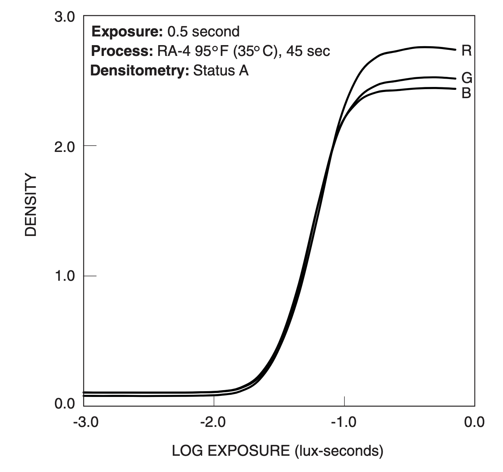

# Towards a more accurate and standard model for Print Film Inversion.

## The process print film was designed for

Print or negative film, unlike slide/positive film, was designed for printing and not direct viewing.

The timeline of an image hitting a lens and then ending up at our eyes via a normal darkroom print goes like this:

1. A _Scene_ image hits our film stock and causes 3 dyes-"binders" to activate proportionally to the exposure of the light (lux ⋅ seconds) and by the spectral sensitivity curves they are sensitive to. 

2. The film is developed under either ECN-2 or C-41 chemistry which converts the activation of dye-"binders" (also called dye-couplers) recorded in the film, into a _density_ of Cyan, Magenta, and Yellow dyes which filter light that passes through them.

3. Light is shone through the film, either Incandescent or Halogen light (potentially/probably with additional biasing filters), or 3 timed tri-chrome exposures of Red Green and Blue onto a piece of photographic paper, usually RA-4.

4. The RA-4 paper's dye-"binders" respond to this light as the film-stock does: proportionally to exposure and respective spectral sensitivity curves.

5. The paper is developed in a bath where dye is bound to the dye-"binders" producing a piece of paper coated in dyes.

6. _View_ Light is reflected off this paper, attenuated proportionally to the _density_ of the dyes and their respective spectral reflectivity curves, hits our eyes and is finally _perceived_ as colour.

## The issues with common digital inversion processes

Many common digital inversion processes seek to emulate this by measuring the effect of Incandescent or "High-CRI" light through the film onto a colour-filter-array camera sensor. In a sense the Digital Camera replaces the RA-4 paper and produces a measurement of this light, from there are a variety of methods are employed to get this image align with what the RA-4 paper WOULD have done had the "same" light hit it. 

The problem though is that cameras do not measure light, they measure colour. A distinction which we'll expand upon shortly, but essential colour as has [Metamerism](https://en.wikipedia.org/wiki/Metamerism_(color)).This creates a question as to what the numbers measured in the camera sensor _mean_ and what was actually _measured_. Two different cameras might produce different relative readings, two different light sources similarly. 

Due to the broad sensitivities of the filters in CFA cameras, "High-CRI" light cannot provide accurate measurements of dye density due to cross-talk. The R,G,B pixels will receive light from part of the spectrum that RA-4 paper would not normally respond to. 

White-balancing, camera profiles, and a push towards similar "High-CRI" light-sources work to _lessen_ these issues ([Aurélien Pierre's explaination of how this processes is done in darktable](https://www.youtube.com/watch?v=DiNlHBZE888/)), and it is possible to produce great images this way but the issue remains of calibrating every light to every camera and this produces inconsistencies as most people do not and cannot do this.

"High-CRI" light sources are also not the same as CCT, Incandescent or standard illuminants, they are also _rarely even the same as each other_. This inconsistency, and unquantifiable inconsistency at that, causes variability in colour reproduction. Cameras' colour transformation matrices (to go from their own RGB to standard XYZ space) depend on reference illuminant conditions and only work accurately within them (usually it is a D55 or such which is based on real-daylight). Outside of that they are liable to produce odd colours. Our eyes use a dynamic colour balancing 

[📄 Academy of Motion Picture Arts and Sciences - Solid State Lighting Project](https://www.oscars.org/science-technology/sci-tech-projects/solid-state-lighting)

> Dedicated scanners have their sensor calibrated to their light specifically which does help greatly. But Digital Camera scanning is much more common now. 

###### Further reading on the issues of broad-spectrum light based measurements:

[📄 jackw01 - RGB Scanlight](https://jackw01.github.io/scanlight/)
[📄 Negative Lab Pro Forum discussion on RGB lights](https://forums.negativelabpro.com/t/rgb-light-vs-high-cri-light-possible-project/5457)

> Professional, lab-grade scanners such as Frontier and Noritsu scanners do not use broad-spectrum light they use narrow-band RGB illumination and monochrome sensors as it allows them to determine MORE information about the negative, namely dye-density, rather than trying to skip parts of the process and jump straight to colour.
Monochrome sensors are often used for Astrophotography and are ideally the best thing to use to measure what we want (density) but they are also usually significantly more expensive than colour-filter-array cameras of a similar resolution. (If you're dealing with 8mm spools though there are definitely more affordable options available and for archiving this is probably what you'd want to pursue this)

## Colour

Colour relates to, but is not the same as, Light. Colour is a _perceived_ phenomena, it is determined in the eye and the brain. 

> The following section (and most of colour theory) assumes and works with what the CIE calls "normal" vision and "standard observers" which usually refers to sun-illuminated conditions for the centers of vision in people with no visual impairments relating to colour within the 2 degree window of vision (yes its really different based on the field of view, your brain just pretends it isn't)

When spectra of light hits the eye, it is sensed by 3 cones Long, Medium and Short. The relative intensities of these three signals produce what we know as colour.

###### Eye cone sensitivities 

Through as series of very clever experiments and mathematics, scientists determined the CIE XYZ colour space which allows us to reasonably accurately go from relative amounts of 3 wavelengths of light to a consistent sensation of colour. This allows us to reason about colour in a digital medium and reproduce it.

###### CIE Chromaticity Diagram

One of the issues though is that the mapping from wavelengths/spectra of light into colour is a lossy, one-way process. It is not possible to go from the tri-stimulus values (or the raw RGB values of a camera sensor which work similarly) to the spectra of light that produced it. This is where we get Metamerism.

Similarly the ways in which we define our fixed colour primaries within this space (R,G,B,Illuminant) define the axes of any transformations we perform on them (e.g adding 10 to the R channel moves us 10 "steps" along the R axis within that colour space). 

###### sRGB colour space

It is non-trivial then to deal with what happens when we have to do mathematics and operations on the values _within_ a colour space. If we double the values of the R channel, how this affects perceived colour will depend on what colour space we're in. This means we have to be very careful about which operations we can perform while inside a colour space to avoid becoming misaligned with what we _think_ we're doing to the colour and what we _are_ doing to the colour.

Ultimately, we should defer dealing with colour until the latest possible step in the process, and stick to more measurable and simpler mathematical objects such as Density and Transmissivity. 

###### Further reading on the issues of trying to work mathematically with colour without being careful:

[📄 darktable's Scene-referred vs Display-referred pipelines](https://docs.darktable.org/usermanual/3.6/en/overview/workflow/edit-overview/)
[📽️ Computer Color is Broken - minutephysics](https://www.youtube.com/watch?v=LKnqECcg6Gw)

## Density measurement

Density and Transmissivity in film photography are two sides of the same coin. The denser the dye filters are, the less transmissive they are to the light they filter. The benefit is that we can _measure_ Density by measuring transmissivity. Cameras are setup quite well to tell us the relative difference between two pixels there are areas of the scan which we can peg to known values. 

The light itself (seen through the sprocket holes or measured with no film present) can be set to return the max the sensor can output. 255 (8-bit), 1024 (10-bit), or 4096 (12-bit) then would form the upper-bound for transmissivity of 1.

From this we can measure the relative transmissivity of the dyes for each respective colour channel.

Using sequential, narrow-band RGB light, the camera's specific sensitivities don't affect the output other than in exposure time _or_ bit-depth, as we're measuring the difference where the only change is the presence of the film's dye-filters.

We could theoretically read a blue wavelength's (~450nm) transmissivity with our red pixels on our bayer camera, we'd just have to wait a very long time. By the time the red pixels hit the max reading through the sprocket holes, the yellow dye of an image will have attenuated our image pixels just as much proportionally as if we'd used the blue pixels. Given that CFA cameras are generally linear in their readings, half as much light received is still half as much light whether it takes a second or 2 minutes.

What we have measured though is the transmissivity of _a specific a specific wavelength_ (most LEDs are 10-20nm bands that can be approximated as single-wavelength), not necessarily the density of the dyes. Depending on the wavelength, we might be attenuated exactly proportionally to the density (if we line up perfectly with the peak of its filter) or proportional to the dye density _and_ by a fall-off factor of the dye's filter.

This means that depending on our chosen wavelengths of RGB light, we might produce different readings of density.  If we know the wavelengths however, and the spectral dye-density curves of the film-stock, we should be able to work out a term to undo the fall-off factor for each dye.

> Most RGB sources will list their wavelengths in some capacity. It seems tricker to get these for print-films but further research can categorise these more precisely over time.

Modelling each dye's falloff as a Gaussian/normal distribution around their peak wavelength we can estimate the amount our reading is off from if we had matched the peaks perfectly.

$$ offset = exp({-({\lambda_{actual} - \lambda_{peak})^2}\over{variance^2}}) $$

e.g. if our blue LED is at 470nm but our yellow dye peaks filtering at 450nm with a variance of around 50 (squared-distance from mean - usually ~50 works but compare to data-sheets):

$$ exp({-({470 - 450)^2}\over{50^2}}) \approx 0.87 $$

We can then multiply our reading by this constant, and adjust our transmissivity to what it _should_ have been had we aligned our wavelengths perfectly.

e.g. if we measured transmissivity of 0.8 of the 470nm wavelength light coming through relative to max unimpeded of 1, had we aligned to the dye's peak of 450nm filtering with a 450nm LED, we'd have actually measured:
$$ 0.8*0.87 = 0.696$$

The image is denser than we'd initially measured but we weren't aligned as nicely with its peaks for filtering to detect that.

> Had we used exactly matching wavelengths our coefficient would be 1 as exp(0) = 1, and our readings would directly measure density

This model only works where the distribution is normal thus ideally near the peaks - this is why if we used a 600nm LED to measure the yellow dye's density, the co-effient calculated above would trend to 0 and if we had any results, push them further away from useable bit-depth. So we should still try and align our lights as much as possible, this method allows us to compensate for when perfect alignment isn't possible.

> We could make and store a look-up table if we wanted to model more accurately reality, but the Gaussian works well enough for relatively close wavelength alignments.

Thus far we have removed the effects of:

1. Specific camera sensitivities through measuring _relative_ light gathered
2. Specific wavelength of R, G, and B light by modelling the effect of our imperfectly aligned light to the dyes' peak effective ranges

The only variability left in our measurement is the density of each dye layer.

These two issues are the core of where current inversion processes fall down and require large amounts of work to ensure compatibility and calibration. 

With that solved we can move on to...

### Making a print

RA-4 paper can be either exposed with white, incandescent light ("High-CRI", etc.) with filters to affect the colour balance _or_ with a tri-colour using time to manage the colour balance.

[📽️ Tricolor Additive Printing For RA-4 - The Naked Photographer](https://www.youtube.com/watch?v=TJ1b5idnlFY)

Many inversion software seeks to emulate the former process, as the light is captured more similarly to this, but we can get better precision and repeatability by emulating the later as we eliminate the variability of the light and the camera's colour mapping.

We can use our relative transmissivity reading for each channel, multiply it by an exposure time and get a reasonable model of lux⋅seconds RA-4 paper _would_ have been exposed to. From lux⋅seconds we can transform/map this value using the characteristic curves provided in a papers' data-sheet to produce a measure of paper-dye density.

##### Kodak Endura Characteristic curves

The benefit of altering the colour balance of the exposure before calculating paper dye density is that we can emulate the falloffs and soft curves of traditional of film prints for free. Many software performs a "tone-map" like this but then does edits on-top in a linear, unreal way. 